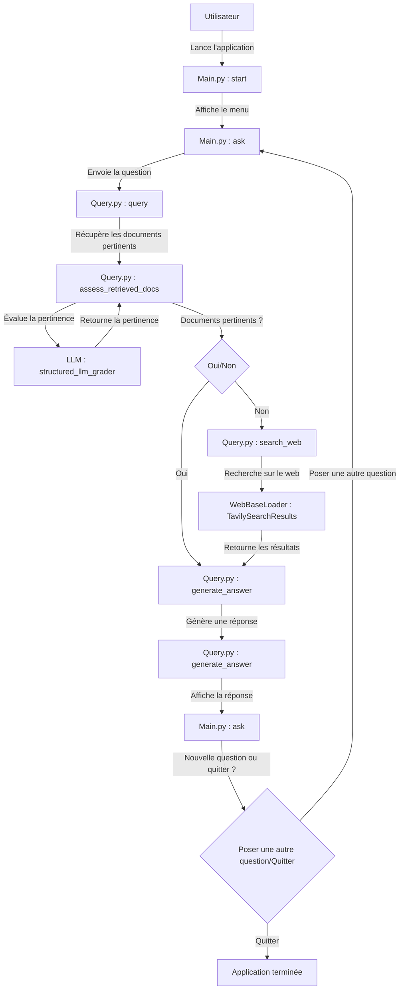

```mermaid
graph TD
    A[Utilisateur] -->|Lance l'application| B[Main.py : start]
    B -->|Affiche le menu| C[Main.py : ask]
    C -->|Envoie la question| D[Query.py : query]
    D -->|Récupère les documents pertinents| E[Query.py : assess_retrieved_docs]
    E -->|Évalue la pertinence| F[LLM : structured_llm_grader]
    F -->|Retourne la pertinence| E
    E -->|Documents pertinents ?| G{Oui/Non}
    G -->|Oui| H[Query.py : generate_answer]
    G -->|Non| I[Query.py : search_web]
    I -->|Recherche sur le web| J[WebBaseLoader : TavilySearchResults]
    J -->|Retourne les résultats| H
    H -->|Génère une réponse| K[Query.py : generate_answer]
    K -->|Affiche la réponse| L[Main.py : ask]
    L -->|Nouvelle question ou quitter ?| M{Poser une autre question/Quitter}
    M -->|Poser une autre question| C
    M -->|Quitter| N[Application terminée]


```
